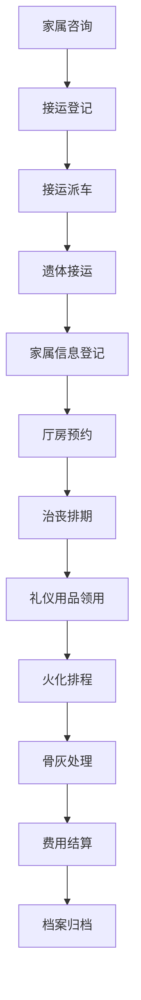
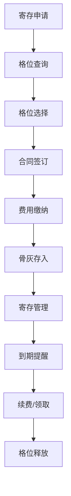

## 1. 产品概述
殡葬礼仪服务调度系统是一款面向殡仪馆的专业管理客户端软件，用于统一管理治丧全流程、设施排期和物资调配。系统通过数字化手段提升殡葬服务效率，规范服务流程，实现遗体接运、厅房调度、火化排程、骨灰寄存、费用结算等全环节的智能化管理。

- 主要用途：殡仪馆内部管理治丧流程、优化资源配置、提升服务质量
- 目标用户：殡仪馆管理人员、接运调度员、厅房管理员、礼仪服务人员、财务结算人员
- 核心价值：实现殡葬服务全流程数字化管理，提高运营效率，减少人工差错，提升家属满意度

## 2. 核心功能

### 2.1 用户角色

| 角色 | 注册方式 | 核心权限 |
|------|----------|----------|
| 系统管理员 | 后台创建 | 系统配置、用户管理、权限分配、数据备份 |
| 接运调度员 | 后台创建 | 接运登记、派车管理、家属信息登记 |
| 厅房管理员 | 后台创建 | 告别厅预约、守灵间分配、设施排期 |
| 礼仪主管 | 后台创建 | 司仪排班、礼仪用品管理、服务质量监控 |
| 火化调度员 | 后台创建 | 火化炉排程、火化状态管理 |
| 寄存管理员 | 后台创建 | 骨灰寄存管理、格位分配、到期提醒 |
| 财务人员 | 后台创建 | 费用结算、补贴核算、收费明细、档案查询 |

### 2.2 功能模块

1. **接运登记**：遗体接运派车、家属信息登记、接运状态追踪
2. **治丧排期**：司仪主持排班、治丧流程安排、服务人员调配
3. **厅房调度**：告别厅时段预约、守灵间分配、设施使用状态监控
4. **礼仪用品**：寿衣花圈库存管理、骨灰盒领用、物资采购入库
5. **火化排程**：火化炉排程管理、火化状态追踪、骨灰领取登记
6. **骨灰寄存**：寄存格位管理、寄存到期提醒、寄存续费管理
7. **费用结算**：丧葬补贴核算、收费明细生成、治丧档案查询

### 2.3 页面详情

| 页面名称 | 模块名称 | 功能描述 |
|----------|----------|----------|
| 工作台 | 数据概览 | 今日接运统计、厅房使用率、火化排程、到期提醒、关键指标看板 |
| 接运登记 | 接运管理 | 新增接运单、派车分配、接运状态更新、家属信息录入与查询 |
| 治丧排期 | 排期管理 | 司仪排班表、治丧流程时间轴、服务人员分配、冲突检测 |
| 厅房调度 | 资源调度 | 告别厅时段预约日历、守灵间分配、设施状态实时监控 |
| 礼仪用品 | 库存管理 | 寿衣花圈库存、骨灰盒领用登记、库存预警、采购入库 |
| 火化排程 | 火化管理 | 火化炉排程表、火化状态更新、骨灰领取登记、火化证明 |
| 骨灰寄存 | 寄存管理 | 格位分布图、寄存登记、到期提醒、续费管理、领取登记 |
| 费用结算 | 财务管理 | 费用明细生成、丧葬补贴核算、收费确认、治丧档案查询 |

## 3. 核心流程

### 3.1 治丧服务主流程

家属到店或电话咨询 → 接运登记创建服务单 → 遗体接运派车 → 家属信息完善 → 厅房预约（告别厅/守灵间） → 治丧排期（司仪/礼仪服务） → 礼仪用品领用 → 火化排程 → 骨灰寄存/领取 → 费用结算 → 档案归档

### 3.2 骨灰寄存流程

寄存申请 → 格位查询与选择 → 寄存合同签订 → 费用缴纳 → 骨灰存入 → 定期续费提醒 → 到期/领取 → 格位释放

## 4. 用户界面设计

### 4.1 设计风格

- **主色调**：深邃蓝 (#1E3A5F) - 代表庄重、专业、沉稳
- **辅助色**：香槟金 (#C9A962) - 体现尊重、纪念、高端
- **中性色**：深灰 (#2D3748)、中灰 (#4A5568)、浅灰 (#E2E8F0)、白色 (#FFFFFF)
- **警示色**：深红 (#C53030) - 用于到期提醒、紧急状态
- **成功色**：深绿 (#276749) - 用于已完成、正常状态

- **按钮风格**：扁平化设计，圆角4px，主按钮采用深邃蓝填充配白色文字，悬停时微亮
- **字体**：思源宋体（标题）+ 思源黑体（正文），庄重典雅，易于阅读
- **布局风格**：左侧导航栏 + 顶部工具栏 + 主内容区，卡片式模块布局
- **图标风格**：线性图标，简洁专业，避免过于花哨

### 4.2 页面设计概览

| 页面名称 | 模块名称 | UI 元素 |
|----------|----------|----------|
| 工作台 | 数据概览 | 数据统计卡片、实时状态面板、待办事项列表、快捷操作入口、图表可视化 |
| 接运登记 | 接运管理 | 接运单列表、新增表单、派车弹窗、状态时间轴、家属信息卡片 |
| 治丧排期 | 排期管理 | 周/月视图日历、排班表格、人员选择器、冲突提示、时间轴视图 |
| 厅房调度 | 资源调度 | 资源日历视图、时段选择器、状态色标、房态图、预约表单 |
| 礼仪用品 | 库存管理 | 库存列表、分类筛选、领用表单、入库记录、库存预警指示器 |
| 火化排程 | 火化管理 | 炉号排程表、状态流转、排队列表、火化记录、领取登记 |
| 骨灰寄存 | 寄存管理 | 格位平面图、寄存登记表、到期提醒列表、续费记录、状态图例 |
| 费用结算 | 财务管理 | 费用明细表格、补贴计算器、收费确认、档案查询过滤器、打印预览 |

### 4.3 响应式设计

- **桌面端优先**：系统主要在殡仪馆内部桌面电脑使用，优先优化1920×1080及以上分辨率
- **平板适配**：支持1024×768以上平板设备，用于现场巡查和移动办公
- **触摸优化**：按钮和交互元素最小尺寸44×44px，支持触摸操作

## 5. 非功能需求

### 5.1 性能要求
- 页面加载时间 ≤ 2秒
- 列表查询响应时间 ≤ 1秒
- 表单提交响应时间 ≤ 500ms
- 支持50+并发用户同时在线

### 5.2 安全要求
- 用户身份认证与权限控制
- 操作日志记录与审计
- 敏感数据加密存储
- 定期数据备份

### 5.3 易用性要求
- 操作流程符合殡仪馆实际工作习惯
- 重要操作提供确认提示
- 数据录入支持联想和自动填充
- 提供操作指引和帮助文档
