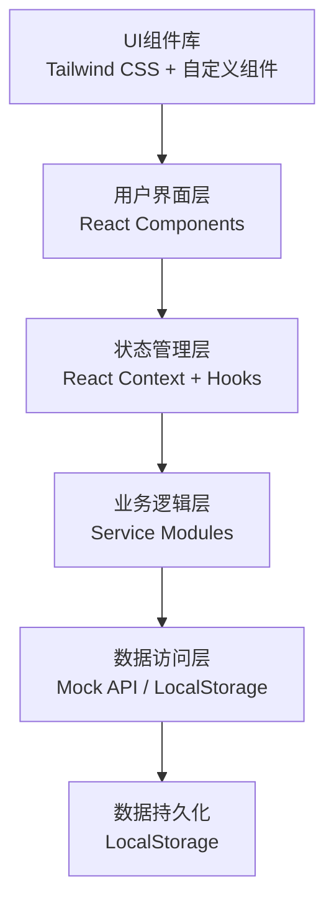
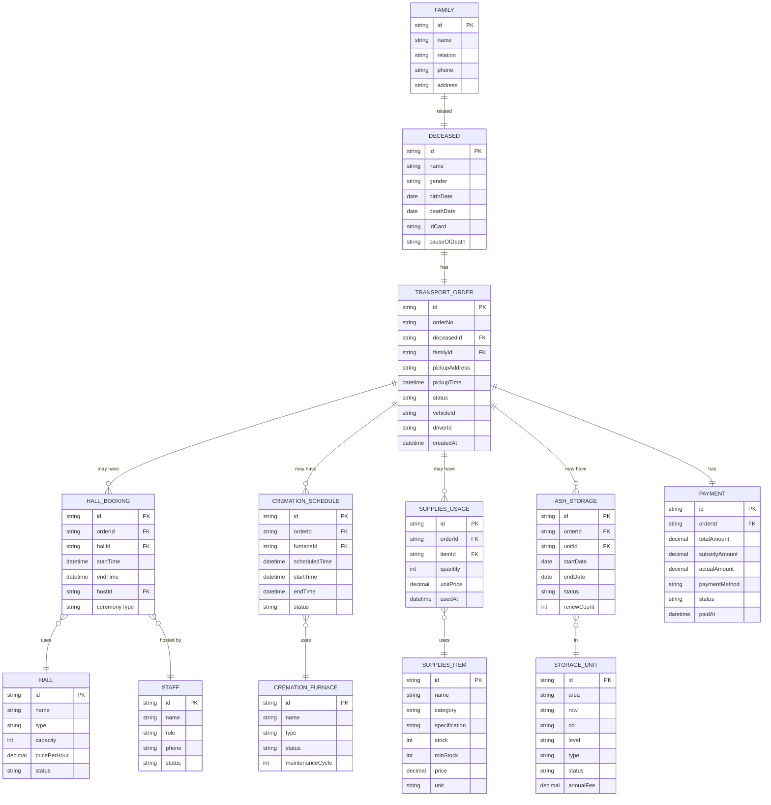

## 1. 架构设计

本系统采用前端单页应用（SPA）架构，通过模拟数据（Mock Data）实现完整的业务逻辑演示。架构层次清晰，便于后续扩展为真实后端服务。



## 2. 技术选型

### 2.1 前端技术栈

| 技术 | 版本 | 用途 |
|------|------|------|
| React | 18.x | 前端框架，构建用户界面 |
| Vite | 5.x | 构建工具，快速开发和打包 |
| TypeScript | 5.x | 类型安全，提升代码质量 |
| Tailwind CSS | 3.x | 原子化CSS框架，快速构建UI |
| React Router | 6.x | 前端路由管理 |
| Lucide React | latest | 图标库，提供专业图标 |
| Recharts | latest | 图表库，数据可视化 |

### 2.2 开发工具

- 包管理器：npm 9.x
- 代码规范：ESLint + Prettier
- 类型检查：TypeScript Compiler

## 3. 项目结构

```
├── src/
│   ├── components/          # 公共组件
│   │   ├── layout/         # 布局组件（侧边栏、顶部栏）
│   │   ├── ui/             # 基础UI组件（按钮、表格、表单等）
│   │   └── common/         # 业务通用组件
│   ├── pages/              # 页面组件
│   │   ├── dashboard/      # 工作台
│   │   ├── transport/      # 接运登记
│   │   ├── schedule/       # 治丧排期
│   │   ├── hall/           # 厅房调度
│   │   ├── supplies/       # 礼仪用品
│   │   ├── cremation/      # 火化排程
│   │   ├── storage/        # 骨灰寄存
│   │   └── settlement/     # 费用结算
│   ├── context/            # 状态管理
│   │   ├── AppContext.tsx
│   │   └── reducers/
│   ├── types/              # TypeScript类型定义
│   │   └── index.ts
│   ├── data/               # 模拟数据
│   │   ├── mockData.ts
│   │   └── initialData.ts
│   ├── services/           # 业务逻辑服务
│   │   ├── transportService.ts
│   │   ├── scheduleService.ts
│   │   ├── hallService.ts
│   │   ├── suppliesService.ts
│   │   ├── cremationService.ts
│   │   ├── storageService.ts
│   │   └── settlementService.ts
│   ├── utils/              # 工具函数
│   │   ├── dateUtils.ts
│   │   ├── formatUtils.ts
│   │   └── storageUtils.ts
│   ├── hooks/              # 自定义Hooks
│   │   └── useLocalStorage.ts
│   ├── App.tsx             # 根组件
│   ├── main.tsx            # 入口文件
│   └── index.css           # 全局样式
├── public/                 # 静态资源
├── .trae/documents/        # 项目文档
├── package.json
├── tsconfig.json
├── vite.config.ts
└── tailwind.config.js
```

## 4. 路由定义

| 路由路径 | 页面名称 | 模块 | 说明 |
|----------|----------|------|------|
| `/` | 工作台 | Dashboard | 数据概览、关键指标、待办事项 |
| `/transport` | 接运登记 | Transport | 接运单管理、派车、家属信息 |
| `/schedule` | 治丧排期 | Schedule | 司仪排班、流程安排 |
| `/hall` | 厅房调度 | Hall | 告别厅、守灵间预约管理 |
| `/supplies` | 礼仪用品 | Supplies | 库存管理、领用登记 |
| `/cremation` | 火化排程 | Cremation | 火化炉排程、状态管理 |
| `/storage` | 骨灰寄存 | Storage | 格位管理、到期提醒 |
| `/settlement` | 费用结算 | Settlement | 费用明细、补贴核算 |

## 5. 数据模型

### 5.1 实体关系图



### 5.2 核心数据类型定义

```typescript
// 逝者信息
interface Deceased {
  id: string;
  name: string;
  gender: '男' | '女';
  birthDate: string;
  deathDate: string;
  idCard: string;
  causeOfDeath: string;
  cremationCertificateNo?: string;
}

// 家属信息
interface FamilyMember {
  id: string;
  name: string;
  relation: string;
  phone: string;
  idCard?: string;
  address: string;
}

// 接运单
interface TransportOrder {
  id: string;
  orderNo: string;
  deceasedId: string;
  familyId: string;
  pickupAddress: string;
  pickupTime: string;
  status: '待派车' | '已派车' | '已接运' | '已完成' | '已取消';
  vehicleId?: string;
  driverId?: string;
  driverName?: string;
  vehiclePlate?: string;
  arrivalTime?: string;
  completedTime?: string;
  remark?: string;
  createdAt: string;
}

// 厅房
interface Hall {
  id: string;
  name: string;
  type: '告别厅' | '守灵间';
  capacity: number;
  pricePerHour: number;
  status: '空闲' | '使用中' | '维修中' | '已预约';
  facilities: string[];
}

// 厅房预约
interface HallBooking {
  id: string;
  orderId: string;
  hallId: string;
  hallName: string;
  startTime: string;
  endTime: string;
  hostId?: string;
  hostName?: string;
  ceremonyType: string;
  status: '待确认' | '已确认' | '进行中' | '已完成' | '已取消';
  remark?: string;
}

// 火化炉
interface CremationFurnace {
  id: string;
  name: string;
  type: '普通炉' | '豪华炉' | '拣灰炉';
  status: '空闲' | '使用中' | '维修中';
  lastMaintenanceDate: string;
  totalUsageCount: number;
}

// 火化排程
interface CremationSchedule {
  id: string;
  orderId: string;
  furnaceId: string;
  furnaceName: string;
  deceasedName: string;
  scheduledTime: string;
  startTime?: string;
  endTime?: string;
  status: '待火化' | '火化中' | '已完成' | '已取消';
  ashCollected: boolean;
  collectorName?: string;
  collectorRelation?: string;
  remark?: string;
}

// 寄存格位
interface StorageUnit {
  id: string;
  area: string;
  row: number;
  col: number;
  level: number;
  type: '普通格' | '中档格' | '高档格' | '家族格';
  status: '空闲' | '已占用' | '维修中' | '已预留';
  annualFee: number;
  location: string;
}

// 骨灰寄存
interface AshStorage {
  id: string;
  orderId: string;
  unitId: string;
  unitLocation: string;
  deceasedName: string;
  startDate: string;
  endDate: string;
  status: '有效' | '即将到期' | '已过期' | '已取出';
  renewCount: number;
  lastRenewDate?: string;
  contractNo: string;
  remark?: string;
}

// 礼仪用品
interface SuppliesItem {
  id: string;
  name: string;
  category: '寿衣' | '寿盒' | '花圈' | '鲜花' | '其他';
  specification: string;
  stock: number;
  minStock: number;
  price: number;
  cost: number;
  unit: string;
  supplier?: string;
  lastPurchaseDate?: string;
}

// 用品领用记录
interface SuppliesUsage {
  id: string;
  orderId: string;
  itemId: string;
  itemName: string;
  quantity: number;
  unitPrice: number;
  totalPrice: number;
  usedAt: string;
  operator: string;
  remark?: string;
}

// 员工
interface Staff {
  id: string;
  name: string;
  role: '司机' | '司仪' | '礼仪师' | '火化师' | '管理员';
  phone: string;
  status: '在岗' | '休假' | '离岗';
  specialty?: string[];
}

// 费用结算
interface Payment {
  id: string;
  orderId: string;
  orderNo: string;
  deceasedName: string;
  items: PaymentItem[];
  totalAmount: number;
  subsidyAmount: number;
  discountAmount: number;
  actualAmount: number;
  paymentMethod: '现金' | '微信' | '支付宝' | '银行卡' | '记账';
  status: '待支付' | '部分支付' | '已支付' | '已退款';
  paidAt?: string;
  invoiceNo?: string;
  operator: string;
  remark?: string;
  createdAt: string;
}

interface PaymentItem {
  id: string;
  name: string;
  type: '接运费' | '厅房费' | '火化费' | '寄存费' | '用品费' | '服务费' | '其他';
  quantity: number;
  unitPrice: number;
  totalPrice: number;
  remark?: string;
}

// 丧葬补贴
interface Subsidy {
  id: string;
  name: string;
  type: '社保补贴' | '民政补贴' | '其他补贴';
  amount: number;
  conditions: string;
  requiredDocuments: string[];
  enabled: boolean;
}
```

## 6. 状态管理设计

### 6.1 全局状态

使用 React Context + useReducer 管理全局状态：

```typescript
interface AppState {
  // 当前用户
  currentUser: Staff | null;
  // 接运单列表
  transportOrders: TransportOrder[];
  // 厅房预约
  hallBookings: HallBooking[];
  // 厅房列表
  halls: Hall[];
  // 火化排程
  cremationSchedules: CremationSchedule[];
  // 火化炉
  furnaces: CremationFurnace[];
  // 寄存记录
  ashStorages: AshStorage[];
  // 格位
  storageUnits: StorageUnit[];
  // 用品库存
  supplies: SuppliesItem[];
  // 费用记录
  payments: Payment[];
  // 员工列表
  staffs: Staff[];
  // 逝者信息
  deceasedList: Deceased[];
  // 家属信息
  familyList: FamilyMember[];
  // UI状态
  ui: {
    sidebarCollapsed: boolean;
    currentPage: string;
    loading: boolean;
  };
}
```

### 6.2 主要 Actions

- `SET_CURRENT_USER` - 设置当前用户
- `LOAD_DATA` - 加载数据
- `ADD_TRANSPORT_ORDER` - 添加接运单
- `UPDATE_TRANSPORT_ORDER` - 更新接运单
- `ADD_HALL_BOOKING` - 添加厅房预约
- `UPDATE_HALL_BOOKING` - 更新厅房预约
- `ADD_CREMATION_SCHEDULE` - 添加火化排程
- `UPDATE_CREMATION_SCHEDULE` - 更新火化排程
- `ADD_ASH_STORAGE` - 添加寄存记录
- `UPDATE_ASH_STORAGE` - 更新寄存记录
- `UPDATE_SUPPLIES_STOCK` - 更新用品库存
- `ADD_PAYMENT` - 添加支付记录
- `TOGGLE_SIDEBAR` - 切换侧边栏

## 7. 关键功能实现思路

### 7.1 厅房调度算法

1. 时间冲突检测：新预约时间段与已有预约时间段的重叠判断
2. 资源最优分配：根据厅房类型、容量、价格智能推荐
3. 时段可视化：日历视图展示各厅房预约情况

### 7.2 火化排程优化

1. 优先级排序：根据死亡时间、家属需求、炉型分配
2. 连续火化优化：同类型炉号连续安排，减少预热能耗
3. 实时状态更新：火化各阶段时间节点自动记录

### 7.3 到期提醒机制

1. 寄存到期前30天、15天、7天、1天多级提醒
2. 红色高亮显示即将到期和已过期记录
3. 支持批量发送提醒通知

### 7.4 费用自动核算

1. 根据服务项目自动汇总费用明细
2. 补贴政策自动匹配计算
3. 支持优惠折扣和账目调整

## 8. 性能优化策略

1. 数据分页加载：大数据列表采用虚拟滚动
2. 局部状态管理：非共享数据使用组件本地状态
3. Memo 优化：复杂组件使用 React.memo
4. 懒加载：路由级别的代码分割
5. 防抖节流：搜索输入和频繁操作优化
